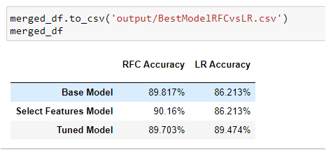

# Machine Learning: Exoplanet Exploration

* [My GitHub Link](https://github.com/GabbyOlivares/Machine-Learning-Challenge)

## Background

Over a period of nine years in deep space, the NASA Kepler space telescope has been out on a planet-hunting mission to discover hidden planets outside of our solar system.

To help process this data, I created some machine learning models capable of classifying candidate exoplanets from the raw dataset.

In this homework assignment, I performed as:

1. [Preprocess the raw data](#Preprocessing)
2. [Tuned the models](#Tune-Model-Parameters)
3. [Compared two models](#Evaluate-Model-Performance)

- - -

## Preprocess the Data

* Preprocess the dataset prior to fitting the model.
* Used `MinMaxScaler` to scale the numerical data.
* Separated the data into training and testing data.

## Tune Model Parameters

* Used `GridSearch` to tune model parameters.
* Tuned and comparedtwo different classifiers.
* Models used were: 
    * `Logistic Regression (LR)` 
    * `Random Forest Classifier (RFC)` 

## Summary Report

* Models Design:
    * Imported my dependencies as well as loaded the expoplanet_data.csv file.
    * Build both models using all 41 features 
    * Instead of deleting columns a priori, I used the base model to evaluate feature importance, and filter the data to include relevant features only.
    * I build a second model by selecting the features model and using the filtered data.
    *Tuned the model parameters using GridSearchCV.
    * Build the final model using the tuned parameters.
    * Evaluated both models and extracted, as csv  and sav files, both Accuracy Report Data Frames.
    * Performed and merged both Accuracy Report Data Frames as a First Glance Comparison Report.

 
 

* Models Comparison and Results:
    * The Comparison Report, at first glance, we can see that `Random Forest Classifier (RFC)` is more accurate than `Logistic Regression (LR)` by so little margin!
     
    * Eventhough, we can also see that the `Tuned Model` applying the Grid Search CV also refine our accuracy target.
     
    * Finally, as for Random Forest, we can see that is highly effective applying a feature selection than Logistic Regression model.
     
    * Conclusions: Given the relatively high accuracy of the RFC model, I believe it to be a reasonable predictor of exoplanet candidacy. However, a model leveraging deep learning techniques might prove superior.

- - -

## Extra Resources

* [Exoplanet Data Source](https://www.kaggle.com/nasa/kepler-exoplanet-search-results)

* [Scikit-Learn Tutorial Part 1](https://www.youtube.com/watch?v=4PXAztQtoTg)

* [Scikit-Learn Tutorial Part 2](https://www.youtube.com/watch?v=gK43gtGh49o&t=5858s)

* [Grid Search](https://scikit-learn.org/stable/modules/grid_search.html)

* [ML Classification and Regression](https://spark.apache.org/docs/latest/ml-classification-regression.html)

* [LR vs RFC](https://dzone.com/articles/logistic-regression-vs-decision-tree#:~:text=Check%20Data%20Types,convert%20it%20into%20numerical%20data.)

- - -

## Hints and Considerations

* Started by cleaning the data, filtering features, and scaling the data.

* Tryed a simple model first, and then tuned the model using `GridSearch`.

* When hyper-parameter tuning, some models have parameters that depend on each other, and certain combinations will not create a valid model. 

* Worked both Models and my Comparison Report in separated Jupyter notebooks, in orde to avoid coding confusion.

- - -

## Submission

* My Jupyter Notebooks for each model are hosted  on GitHub.

* Created a file for my best model and push to GitHub

* Included a README.md file that summarizes my assumptions and findings.

* Submitted the link from my GitHub project to Bootcamp Spot.

##### © 2020 Gabriela Loami Olivares Martinez, BootCamp Tecnologico de Monterrey.
##### © 2020 Trilogy Education Services, a 2U, Inc. brand. All Rights Reserved. 
